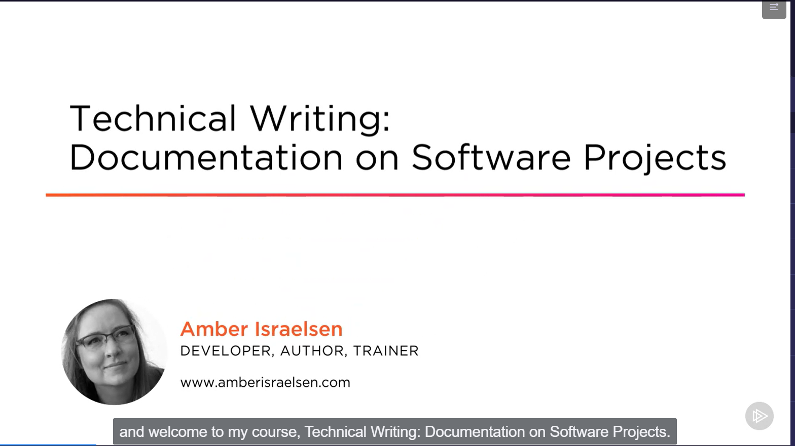
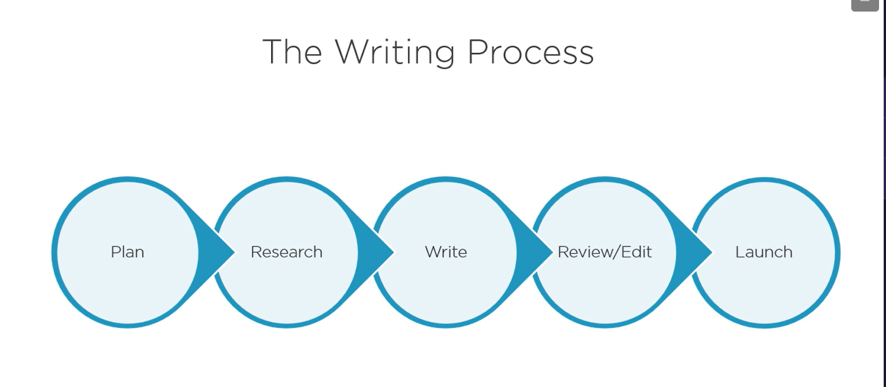
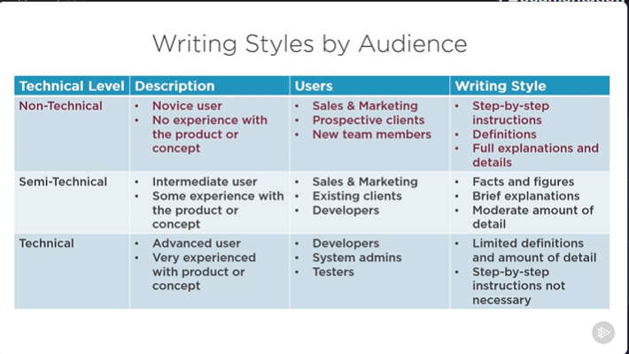

# Technical Writing: Documentation on Software Projects
Pluralsight course from Sir Karlo Piscano of TaskUs  
Started August 20, 2023 - Present time

## Overall Notes

## Chronological Learning

### August 20, 2023
23:20 - 00:00

#### Module 2: Introduction to Technical Writing
- In a perfect world, a technical writer or Business Analyst maintains the documentations of the projects.
- Some developers are assigned to write documentations in mid sized software projects.
- Very few developers enjoy documentation.

**Aversion towards Writing Documentation**
- Developers do not think that it's part of their jobs
- Not enough  time due to deadlines and other pressing matters, docs always gets pushed back
- No one reads documentation
- I already know how it works, why bother document it?

**Main Reason: Terrible documentation from Devs**
- Theyre too close to the product
    - Curse of knowledge
    - Hard for a new user
- Write from the developer's perspective not the user's
- Hard to remove bias and assumptions
    - Troubleshooting and bias information gets overlooked

**Why Technical Writing Is Important (Even for Developers)**
1. Marketing: You have to sell your product
    - sales effort
    - developers need to provide workable materials
2. Gets the information out of your head
    - people will stop asking you for it
3. Gets the team on the same page
    - aligns everyone both the client and devs
4. Reduces support calls, makes users happier
    - user guide
    - troubleshooting
5. Auditor might want to know
    - paper trail, decisions, testing, management
6. Direct reflection of you
    - typos, terrible formatting, errors not documented
    - direct reflection of you and your work

**Technical Documentation in Agile Environments**
1. Essential
    - Document with just barely good enough detail
2. Valuable
    - The benefit of having documentation must outweigh the cost of creating and maintaining it 
3. Timely
    - Documentation should be done in a just-in-time manner when we need it

**Overview on Technical Writing**
 
 
Technical Writing
 - Writing that  helps users solve problems with technologies and technical subject matter
 - Good documentation makes the complex simple
 - Purpose is to get information from the devs to the users

 Common Technical Documents
 - Case Studies, Descriptions, Emails, Letters
 - Instructions and procedures, memos, press releases, proposals, resumes and job applications
 - Specifications, technical reports, white papers, websites

**Course Outline**
1. Introduction to Technical Writing
2. Writing Process
3. Writing Tips and Best Practices
4. Layout and Design
5. Deliverables: Requirements
6. Deliverables: Design/Architecture
7. Deliverables: Code Documentation
8. Deliverables: Test Plans and Test Cases
9. Deliverables: End-User Documentation
10. Conclusion and Additional Resources

#### Module 3: The Writing Process
- how you plan, research, write, edit, and release documentation

##### Plan
- Declare purpose, audience (who the readers are), delivery (medium of the documentation)
- **Purpose** - why would the document exist? What is it supposed to accomplish?
    - Pursuade readers to think or act a certain way
    - Enable them to perform a task
    - Help them understand something
    - Change their attitude towards previous versions or the app itself
- **Audience**
- **Delivery**

**Plan: Software Documentation**
1. Requirements - identify what is to be built, and to verify we're meeting stakeholders' expectations
2. Design/Architecture - defines how the system will be constructed, describing critical components and how they fit together
3. Code/Technical - Enable task completion and understanding of other developers
4. Test Plans/Test Cases - define the approach to testing; expose errors or demonstrate correct behaviour
4. End-User Guide - enable task completion; provide support and troubleshooting

### August 21, 2023
19:00 - 19:30

**Audience**
1. Who will be reading it (demographics)?
2. What do they already know?
3. Why are they going to be reading it?
4. In what environment will they be reading it?
5. What is their state of mind?
    - set based on the situation
6. What do they need to know?
7. What tone is approproate for writing?
    - depends on where you are working and who you are talking to

- Get the demographics of the readers
    - Nationality
    - Medium
    - Technical Knowledge level

**Multiple Audiences**
1. Determine Primary Audience and Secondary Audience
    - Primary Audience - target reader, requested the document, often a decision maker
    - Secondary Audience - may come into contact with the document but the intended reader
2. Best to create separate documents for each type of audience

**Delivery**
- what is the best way to deliver the information to the audience?
- think about how and where the people with documentation will use them

### August 28, 2023
##### Research
- research is the part where you get the information out of the heads of the creators/developers
 
    a. Interview Subject Matter Experts (SMEs) - spend more time here
    - prepare interview questions ahead of time (who, what, when, where, how)
    - keep the questions open-ended
    - each question should focus on one thing/ one topic
    - anticipate possible directions of the interview and think about your response and how you will drive the conversation back on track
    - Schedule the interview 
    - decide if it will be recorded (get permission, give 3 timeslots)
    - add structure or agendas (high level topic areas)
    - Conducting the interview 
        1. Start on time
        2. Build rapport with small talk
        3. Acknowledge expertise on both sides
        4. State goals and topics of the interview
        5. Be confident and relaxed
        6. Practice active listening
        7. Observe body language
        8. Tune out distractions
        9. Ask for additional thoughts before changing topics
        10. Review and confirm action items
        11. Thank them for their time
    
    b. Review Existing Documentation
    
    c. Use the actual software
    - why and how it works
    - what doesnt work and what it is not for
    - possible bugs

##### Write

**1. Organize your content and ideas**
- Create writing plan
- Organize ideas in lists or categories, whatever works
- Chronological, Simple to Complex and vice versa
- Writing formats, headings, charts, graphics
- Style guide

**2. Write the first draft**
- Focus on getting the purpose, audience, ideas written down on paper
- Mind the grammar and other writing specifics later

**3. Review and Revise Work**
- Does the document fulfill its purpose?
- Is anything missing?
- Can anything be taken out?
- What questions will the reader have? And answer them (via FAQs)
- Is the writing easy to understand?
- Check for sentence and paragraph structure, grammar, word choice, spelling
- after this, review and revise again
- each editing pass hould eliminate some amount of content making the document more clear and concise
- aim for precision and eliminate anything that's not essential

##### Review and Edit
- major and extensive review process **with team members**
- purpose is to adjust and reorganize content for the readers
- editing for style (with peer reviewers)
- editing for grammer and punctuation
- incorporate test results in usability testing
- have someone else do it
- read it out lout
- print it out, or change margins for new view
- edit with a knife (cut down own number of pages) - short and necessary

**Usability Testing**
- Line-by-line testing of a document to ensure it makes sense and the instructions work as expected
- Makes the user complete a task to see how quickly and easily they can complete it

**Usability Testing in Documentation**
- make the user go through the instructions step by step to see if it works
- have someone else do it
- test against a live system
- observe the session with user (what questions they have, what doesnt make sense or which things went perfectly well)

##### Launch
- translate if needed
- bundle up final deliverables (eg, READMEs, webpages, PDFs etc)
- Coordinate with development team and other writers to release (usually in conjunction with software)
- Coordinate who's doing what etc
- Create a plan for updates - have a plan in place to keep the documentation fresh and up to date
- have a plan to make sure the documentation is always in sync with bug fixes and enhancements

### Module 4: Writing Tips and Best Practices
#### Style Guide
- set of standards for writing documents
- examples
    - Chicago Manual of Style - history and social science
    - Modern Language Association (MLA) - literature, media, culture publications
    - American Psychological Association (APA) - scientific
    - Others - Microsoft Manual of Style, Associated Press, New York Style
    - [Apple Style Guide](https://help.apple.com/pdf/applestyleguide/en_US/apple-style-guide.pdf)
    - [IBM Style Guide](https://cloudflare-ipfs.com/ipfs/bafykbzacea2aayaalw4rzbhyn4d5hkvtmagoryyeuilyjugh7ntp3kmvfvz6g?filename=%28IBM%20Press%29%20Francis%20DeRespinis%2C%20Peter%20Hayward%2C%20Jana%20Jenkins%2C%20Amy%20Laird%2C%20Leslie%20McDonald%2C%20Eric%20Radzinski%20-%20The%20IBM%20Style%20Guide_%20Conventions%20for%20Writers%20and%20Editors-IBM%20Press%20%282011%29.pdf)
    - [Microsoft Style Guide](https://learn.microsoft.com/en-us/style-guide/welcome/)
    - [Google Developer Style Guide](https://developers.google.com/style)

#### Accuracy
- "Fast is fine, but accuracy is everything" - Wyatt Earp
- Unclear writing can cause confusion at best and fatal errors at worst
- spotting a single error can cause question to the integrity of the document
- Careful conforming to truth or fact

#### Clarity
#### Conciseness
#### Tone
#### Tense
#### Grammar, Spelling, and Terminology
#### Module 4 Summary and Additional Resources

